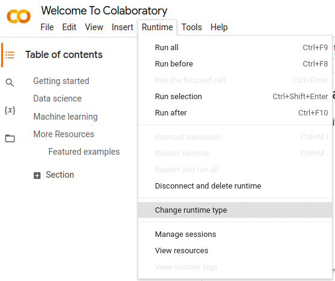
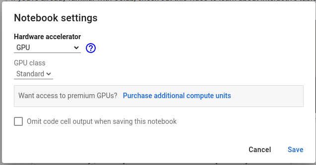
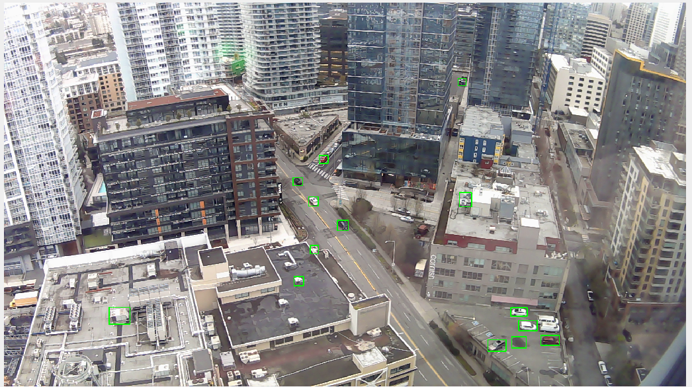
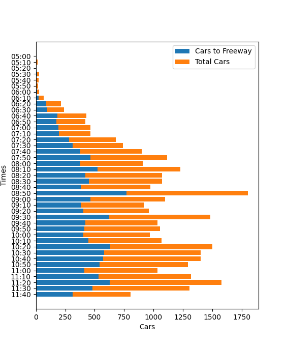

# Building a Car Counter
Building a Car Counter with Python and OpenCV

This is a beginner computer vision project. It is the accompanying code for videos that can be found here:
- [TikTok Vid](https://www.tiktok.com/@codingai/video/7223464864193269038)
- [YouTube Vid](https://youtu.be/Lo4g5Rbqmrs)

This project is intended as a demonstration, and there will be no support.

## Requirements

You need to install the following.

1. Python - [Installation](https://www.python.org/downloads/)
1. OpenCV, Matplotlib
```
pip install opencv-python
pip install matplotlib
```
3. Detectron2 - [Installation](https://github.com/facebookresearch/detectron2#installation)
4. This repository!
```
git clone https://github.com/eric-yim/building-a-car-counter.git
```

### If you don't have a GPU for Object Detection

The object detection mechanism requires a GPU set up with appropriate drivers. If you don't have one set up, you can use [google colab](https://colab.research.google.com/).





Then, instead of running the code on a webcam, you would instead run the code on a video file. You'll have to use colabs built in visualizer instead of cv2.imshow.

## Running the Code

The main entry to the code is ```view_camera.py```. There is a variable in the file called ```NAME_OF_CAMERA``` that you should edit. This can be the name of a video file like ```MY_FILE.mp4``` or a webcam (be sure to put your video file in repository folder or use the absolute path). Your webcam maybe called something like ```/dev/video0``` on Linux or ```"0"``` on Windows. Once that is set, you should be able to run the file.

### Running the System
This opens the camera, runs the system, and shows a visualization on screen. Meanwhile, it appends counts to a file called ```totals.csv```. Press "q" to exit.

```
python view_camera.py
```

### Running only the Object Detector
You can also run only the Object Detector on the sample image provided.
```
python detector.py
```
You should get an image like this.


### Displaying Results
There are sample counts stored in ```totals.csv```. You can display them.
```
python analyze.py
```
You will get a display like this.



## List of Files
1. aggregator.py - measures time increments for outputting counts
1. analyze.py - displays totals.csv using matplotlib
1. colors.py - a list of colors for visualizing tracked objects
1. counter.py - checks line crossing and keeps a count of tracked objects
1. detector.py - runs object detection on image
1. tracker.py - tracks objects
1. view_camera.py - main entry file to system

```sample.png``` and ```totals.csv``` are samples and can be deleted once you have your own system running.

